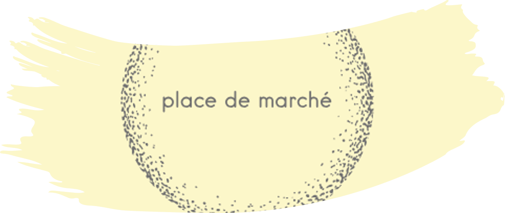

# ASSURER UNE VEILLE TECHNIQUE

Projet realisé en juillet 2025 dans le cadre de ma formation Data Scientist avec CentraleSupélec/OpenClassrooms.

## Objectif du projet

L’entreprise "Place de marché" gère une marketplace e-commerce anglophone sur laquelle des vendeurs proposent des articles à des acheteurs en postant une photo et une description. Pour l'instant, l'attribution de la catégorie d'un article est effectuée manuellement par les vendeurs, et est donc peu fiable. De plus, le volume des articles est pour l’instant très petit. Pour rendre l’expérience utilisateur des vendeurs (faciliter la mise en ligne de nouveaux articles) et des acheteurs (faciliter la recherche de produits) la plus fluide possible, et dans l'optique d'un passage à l'échelle, "Place de marché" a développé un outil de classification supervisée des produits présents sur son site ; l'entreprise souhaite réaliser une veille sur les outils et tendances en reconnaissance d'images numériques afin de démontrer leur capacité ou non à dépasser en performance la modélisation déjà effectuée, afin de rester à jour avec les évolutions du domaine. 

## Ressources

Les données-source sont disponibles en téléchargement direct sur https://s3-eu-west-1.amazonaws.com/static.oc-static.com/prod/courses/files/Parcours_data_scientist/Projet+-+Textimage+DAS+V2/Dataset+projet+pre%CC%81traitement+textes+images.zip

Les différentes pistes de modélisation explorées et leurs résultats sont disponibles dans le repo https://github.com/CelineBoutinon/product-classification.

* **fichiers :**
  - **notebook_1.ipynb :** code Python comparant les résultats de la modélisation des images seules obtenus avec ResNet50 et ceux obtenus avec MobileViTv2
  - **note_methodologique.pdf :** comparaison de l'architecture des concepts des modèles, de leurs structures et des résultats obtenus (avec références bibliographiques)
  - **slideshow.pdf :** diapositives de présentation du projet
 

## Compétences développées

 * Réaliser la présentation orale d’une démarche de modélisation à un client interne/externe
 * Réaliser une veille sur les outils et tendances en data science et IA
 * Rédiger une note méthodologique afin de communiquer sa démarche de modélisation

## Langages & software

 * Python 3.9.13

Voir requirements.txt pour la liste complète des librairies & packages.
  
